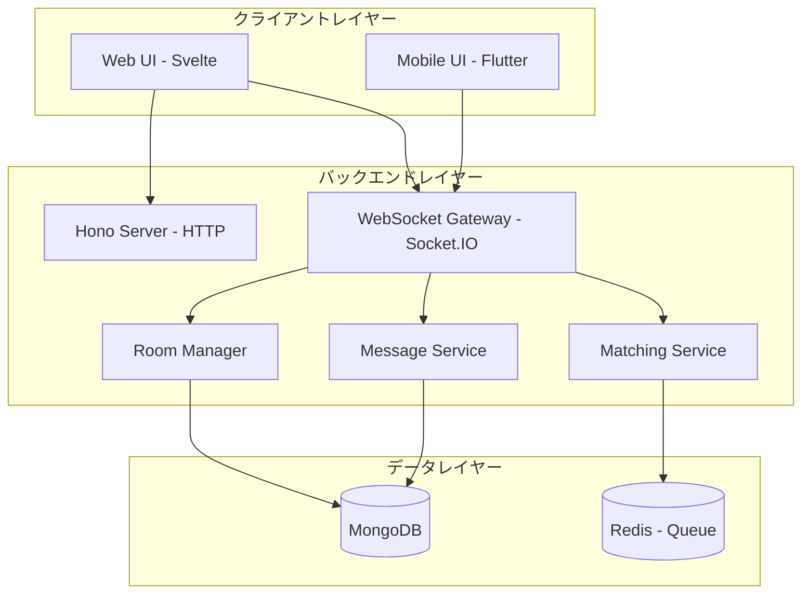
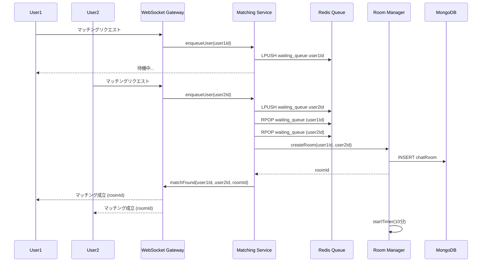
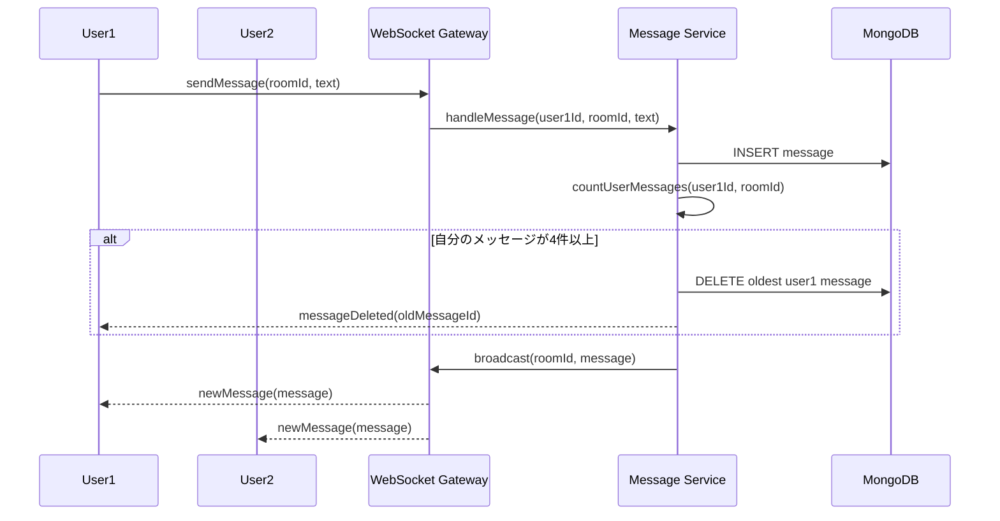
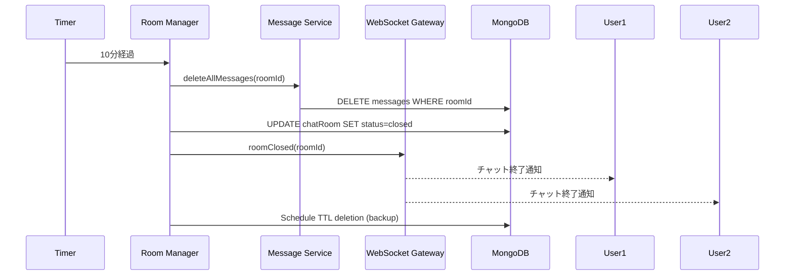
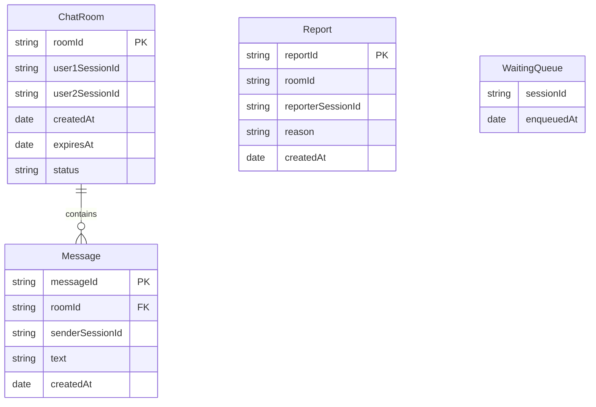

# 技術設計書: Cha-Chat

## Overview

**Purpose**: Cha-Chatは、匿名ユーザー同士が10分間限定で気軽にチャットできるリアルタイムコミュニケーションアプリケーションです。完全匿名性、一時性、シンプルさを核とした価値を提供します。

**Users**: プライバシーを重視し、アカウント登録なしで気軽に会話を楽しみたいユーザーが対象です。暇つぶしや軽い雑談を求める人々が、Webブラウザまたはモバイルアプリからアクセスして利用します。

**Impact**: 新規機能として、マルチプラットフォーム対応のリアルタイムチャットシステムを構築します。WebSocket通信によるリアルタイムメッセージング、自動マッチングシステム、時間制限付きチャットルーム管理、メッセージ自動削除機能を実現します。

### Goals

- 匿名ユーザー同士の自動マッチング機能を実装し、待機時間を最小化する
- WebSocket通信によるリアルタイムメッセージング基盤を構築する
- 10分間のチャットルーム管理と自動終了機能を提供する
- 自分が送信した3つ前より古いメッセージの自動削除ロジックを実装する
- Webブラウザ版（Svelte）とモバイルアプリ版（Flutter）で一貫したユーザー体験を提供する
- 完全匿名性とプライバシー保護を実現し、チャット終了後のデータ完全削除を保証する

### Non-Goals

- ユーザー認証・アカウント管理機能（完全匿名を維持）
- マルチメディアコンテンツ（画像、動画、ファイル）の送受信
- チャット履歴の永続保存やエクスポート機能
- 友達機能や連絡先リスト
- グループチャット（1対1のみ）
- メッセージ検索や編集機能
- リアルタイム翻訳機能（将来検討）

## Architecture

### Architecture Pattern & Boundary Map

**アーキテクチャ統合**:
- **選択パターン**: シンプルレイヤードアーキテクチャ + イベント駆動要素
- **選択理由**: 初期実装の速度とリアルタイム性のバランスを重視。WebSocket中心のプロジェクトに適合し、実装複雑度を抑えながら必要な機能を提供できる。
- **ドメイン/機能境界**:
  - **マッチングドメイン**: ユーザー待機キュー管理、マッチングロジック、セッション生成
  - **チャットルームドメイン**: ルーム状態管理、タイマー制御、参加者管理
  - **メッセージングドメイン**: メッセージ送受信、削除ロジック、WebSocket通信
  - **クライアントレイヤー**: Web/モバイルUI、ローカル状態管理、WebSocket接続管理
- **既存パターンの保持**: 新規プロジェクトのため該当なし
- **新規コンポーネントの根拠**:
  - MatchingService: 匿名マッチングの独立した責務
  - RoomManager: チャットルームのライフサイクル管理
  - MessageService: メッセージ送受信と削除ロジックの分離
  - WebSocketGateway: リアルタイム通信のエントリーポイント
- **ステアリング準拠**: プロダクトビジョン（匿名性・一時性・シンプルさ）と技術スタック要件に整合



**主要な設計決定**:
- **バックエンドフレームワーク**: Hono v4.11.8を採用（軽量高速、Web Standards準拠、モダンAPI）
- **バックエンド通信**: Socket.IO v4.8.3を採用（自動再接続、room管理機能、Honoと並行動作）
- **Hono + Socket.IO統合**: HonoでHTTPエンドポイントを処理、Socket.IOでWebSocketリアルタイム通信を処理（別々のポートまたは同一ポート）
- **マッチングアルゴリズム**: 初期実装はシンプルなFIFOキューベース（将来的に興味ベースマッチング拡張可能）
- **メッセージ削除**: サーバー側での明示的削除 + MongoDB TTLインデックスをフェイルセーフとして併用
- **状態管理**: Web版はSvelte Store、モバイル版はRiverpod（各プラットフォームの標準的手法）

### Technology Stack

| Layer | Choice / Version | Role in Feature | Notes |
|-------|------------------|-----------------|-------|
| **Frontend - Web** | Svelte v5.49.0 | Webブラウザ版UI実装 | Runes、Snippets、改善されたTypeScript対応 |
| | socket.io-client v4.8.3 | WebSocket通信クライアント | Socket.IOサーバーとの双方向通信 |
| | Svelte Store | 状態管理 | チャット状態、メッセージ履歴の管理 |
| **Frontend - Mobile** | Flutter v3.38.6 | iOS/Androidアプリ実装 | iOS 26、Xcode 26、macOS 26完全対応 |
| | socket_io_client | WebSocket通信クライアント | Socket.IOサーバーとの双方向通信 |
| | Riverpod | 状態管理 | 型安全な状態管理、テスト容易性 |
| **Backend - Runtime** | Node.js v24.13.0 LTS "Krypton" | サーバーランタイム | 2028年4月までLTSサポート、非同期I/O |
| | Hono v4.11.8 | HTTPフレームワーク | 軽量高速、Web Standards準拠、モダンAPI |
| | Socket.IO v4.8.3 | WebSocketサーバー | リアルタイム双方向通信、room管理 |
| | TypeScript | 開発言語 | 型安全性、保守性向上 |
| **Data - Storage** | MongoDB | プライマリデータストア | ドキュメント指向、TTLインデックス対応 |
| | MongoDB Node.js Driver v7.1.0 | MongoDB接続ドライバー | 最新BSON機能、パフォーマンス改善 |
| **Data - Cache/Queue** | Redis | マッチングキュー管理 | 高速なキュー操作、セッション管理 |
| **Infrastructure** | pnpm workspace | モノレポ管理 | Web版とバックエンドの依存関係統合管理 |
| | Biome | リンター/フォーマッター | コード品質統一 |

**詳細な根拠**:
- Honoの選択: 軽量かつ高速、Web Standards準拠でモダンなAPI。Socket.IOとの統合が可能（Node.js環境）。将来的に他のランタイム（Bun、Deno等）への移行も視野に入れやすい（`research.md` 参照）
- Socket.IOの選択: 調査により、ネイティブWebSocketと比較して開発速度と機能豊富さで優位。チャットルーム管理機能が組み込み済み。Honoと並行動作。trade-offとして若干のオーバーヘッドがあるが、初期実装には適切（`research.md` 参照）
- MongoDBのTTLインデックス: チャット終了後の自動削除を保証するフェイルセーフ機構。最大60秒の削除遅延があるが、明示的削除と組み合わせることで問題なし（`research.md` 参照）
- Redis導入: マッチングキューの高速処理と並行制御のため。将来的なスケーラビリティ拡張にも対応可能（`research.md` 参照）
- 最新バージョン採用: 2026年2月時点の安定版を使用し、長期サポートと最新機能を確保（`research.md`、`tech.md` 参照）

## System Flows

### マッチングフロー



**主要な決定事項**:
- FIFOキューベースのシンプルなマッチングアルゴリズムを採用（公平性と実装速度を優先）
- Redis LPUSHとRPOPでアトミックなキュー操作を実現
- マッチング成立時に即座にチャットルームを作成し、10分タイマーを開始
- マッチング待機中はWebSocket接続を維持し、リアルタイムで成立通知を送信

### メッセージ送受信フロー



**主要な決定事項**:
- メッセージ送信と削除判定を同一トランザクションで処理（整合性保証）
- 各ユーザーが送信したメッセージ数をカウントし、4件以上なら最古のメッセージを削除
- 削除はサーバー側で実行し、クライアントに通知（UIから即座に非表示）
- WebSocketのroom機能でチャットルーム内の全参加者にブロードキャスト

### チャットルーム終了フロー



**主要な決定事項**:
- 10分タイマー終了時に全メッセージを明示的に削除
- チャットルーム状態を`closed`に更新（監査ログとして一時保持）
- TTLインデックスをフェイルセーフとして設定（万が一削除失敗時の保険）
- ユーザーに終了通知を送信し、新しいマッチングを促進

## Requirements Traceability

| Requirement | Summary | Components | Interfaces | Flows |
|-------------|---------|------------|------------|-------|
| 1.1 | 待機中ユーザーと自動ペアリング | MatchingService | MatchingServiceInterface | マッチングフロー |
| 1.2 | マッチング不可時に待機キューへ追加 | MatchingService | MatchingServiceInterface | マッチングフロー |
| 1.3 | マッチング成立時に新規チャットルーム作成 | RoomManager | RoomManagerInterface | マッチングフロー |
| 1.4 | 完全匿名マッチング | MatchingService, SessionManager | SessionInterface | マッチングフロー |
| 2.1 | チャットルーム作成時に10分タイマー開始 | RoomManager | RoomManagerInterface | チャットルーム終了フロー |
| 2.2 | 残り時間を両ユーザーに表示 | WebSocketGateway, RoomManager | WebSocketEventContract | チャットルーム終了フロー |
| 2.3 | 10分経過後に自動終了 | RoomManager | RoomManagerInterface | チャットルーム終了フロー |
| 2.4 | 終了時に全メッセージ削除 | MessageService, RoomManager | MessageServiceInterface | チャットルーム終了フロー |
| 2.5 | ユーザー途中退出時に通知と終了 | RoomManager, WebSocketGateway | WebSocketEventContract | チャットルーム終了フロー |
| 3.1 | メッセージ即座配信 | MessageService, WebSocketGateway | WebSocketEventContract | メッセージ送受信フロー |
| 3.2 | テキストのみ送信許可 | MessageService | MessageServiceInterface | メッセージ送受信フロー |
| 3.3 | メッセージ送信時刻記録 | MessageService | MessageModel | メッセージ送受信フロー |
| 3.4 | 送信者識別子付与 | MessageService | MessageModel | メッセージ送受信フロー |
| 3.5 | 送信失敗時のエラー通知 | WebSocketGateway | WebSocketEventContract | メッセージ送受信フロー |
| 4.1 | 新規メッセージ送信時に履歴評価 | MessageService | MessageServiceInterface | メッセージ送受信フロー |
| 4.2 | 自分のメッセージ4つ以上で最古削除 | MessageService | MessageServiceInterface | メッセージ送受信フロー |
| 4.3 | 最新3件のみ保持 | MessageService | MessageServiceInterface | メッセージ送受信フロー |
| 4.4 | 相手メッセージは削除対象外 | MessageService | MessageServiceInterface | メッセージ送受信フロー |
| 4.5 | 削除時にUI即座非表示 | WebUI, MobileUI, WebSocketGateway | WebSocketEventContract | メッセージ送受信フロー |
| 5.1 | Webブラウザ版フロントエンド | WebUI (Svelte) | - | - |
| 5.2 | モバイルアプリ版フロントエンド | MobileUI (Flutter) | - | - |
| 5.3 | UI/UX一貫性保持 | WebUI, MobileUI | UIComponents | - |
| 5.4 | 同一バックエンドAPI使用 | WebSocketGateway | WebSocketEventContract | 全フロー |
| 5.5 | 同一マッチングプール | MatchingService | MatchingServiceInterface | マッチングフロー |
| 5.6 | レスポンシブデザイン | WebUI | UIComponents | - |
| 6.1 | 残り時間カウントダウン表示 | WebUI, MobileUI, RoomManager | UIComponents, WebSocketEventContract | チャットルーム終了フロー |
| 6.2 | 自分/相手メッセージ視覚的区別 | WebUI, MobileUI | UIComponents | - |
| 6.3 | テキスト入力と送信ボタン提供 | WebUI, MobileUI | UIComponents | メッセージ送受信フロー |
| 6.4 | メッセージ一覧リアルタイム更新 | WebUI, MobileUI, WebSocketGateway | WebSocketEventContract | メッセージ送受信フロー |
| 6.5 | チャット終了通知と再マッチング促進 | WebUI, MobileUI, WebSocketGateway | WebSocketEventContract | チャットルーム終了フロー |
| 6.6 | Web/モバイル同等機能提供 | WebUI, MobileUI | UIComponents | 全フロー |
| 7.1 | 個人情報を収集しない | SessionManager | SessionInterface | マッチングフロー |
| 7.2 | セッションごと匿名識別子生成 | SessionManager | SessionInterface | マッチングフロー |
| 7.3 | 終了後に完全削除 | MessageService, RoomManager | MessageServiceInterface | チャットルーム終了フロー |
| 7.4 | チャットルーム外アクセス不可 | WebSocketGateway, RoomManager | WebSocketEventContract | 全フロー |
| 7.5 | 不適切コンテンツ報告機能 | ReportService | ReportServiceInterface | - |

## Components and Interfaces

### コンポーネント概要

| Component | Domain/Layer | Intent | Req Coverage | Key Dependencies | Contracts |
|-----------|--------------|--------|--------------|--------------------------|-----------|
| HonoServer | Backend/HTTP | HTTPエンドポイント処理（ヘルスチェック、API等） | - | Node.js (P0) | API |
| WebSocketGateway | Backend/通信 | WebSocket接続とイベントルーティング | 全要件 | Socket.IO (P0), HonoServer (P0) | API, Event |
| MatchingService | Backend/ドメイン | ユーザーマッチングロジック | 1.1-1.4, 5.5 | Redis (P0), RoomManager (P0) | Service, Event |
| RoomManager | Backend/ドメイン | チャットルーム管理とタイマー制御 | 2.1-2.5, 6.1 | MongoDB (P0), MessageService (P1) | Service, State |
| MessageService | Backend/ドメイン | メッセージ送受信と削除ロジック | 3.1-3.5, 4.1-4.5 | MongoDB (P0), WebSocketGateway (P0) | Service, Event |
| SessionManager | Backend/セキュリティ | 匿名セッション生成と管理 | 1.4, 7.1-7.2 | なし | Service |
| ReportService | Backend/セキュリティ | 不適切コンテンツ報告処理 | 7.5 | MongoDB (P0) | Service |
| WebUI | Frontend/Web | Svelte実装のWebブラウザUI | 5.1, 5.3, 5.6, 6.1-6.6 | Socket.IO Client (P0), Svelte Store (P0) | State |
| MobileUI | Frontend/Mobile | Flutter実装のモバイルアプリUI | 5.2, 5.3, 6.1-6.6 | socket_io_client (P0), Riverpod (P0) | State |

### Backend / HTTP層

#### HonoServer

| Field | Detail |
|-------|--------|
| Intent | HTTPエンドポイントの提供（ヘルスチェック、メトリクス、将来的なREST API等） |
| Requirements | - |

**Responsibilities & Constraints**
- HTTPリクエストの受信と処理
- ヘルスチェックエンドポイントの提供（`GET /health`）
- Socket.IOサーバーと同一Node.jsサーバー上で並行動作
- 将来的なREST APIエンドポイントの拡張基盤

**Dependencies**
- Inbound: クライアント（Webブラウザ、監視ツール等） — HTTPリクエスト (P1)
- External: Node.js http.createServer — HTTPサーバー作成 (P0)

**Contracts**: API [X]

##### API Contract

| Method | Endpoint | Request | Response | Errors |
|--------|----------|---------|----------|--------|
| GET | /health | - | `{ status: 'ok', timestamp: string }` | 500 (サーバーエラー) |

**Implementation Notes**
- Integration: `http.createServer(app.fetch)`でNode.js HTTPサーバーを作成し、Socket.IOサーバーと共有
- Validation: リクエストペイロードは必要に応じてバリデーション（現時点ではヘルスチェックのみ）
- Risks: 特になし（シンプルな実装）

### Backend / WebSocket通信層

#### WebSocketGateway

| Field | Detail |
|-------|--------|
| Intent | WebSocket接続の確立、切断、イベント受信とルーティングを担当 |
| Requirements | 全要件（通信の中心点） |

**Responsibilities & Constraints**
- Socket.IOサーバーの初期化と接続管理
- クライアントからのイベント受信と適切なサービスへのディスパッチ
- サーバーからクライアントへのイベント送信（個別送信、ルーム内ブロードキャスト）
- 接続エラー、切断、再接続のハンドリング

**Dependencies**
- Inbound: WebUI, MobileUI — WebSocket接続とイベント送信 (P0)
- Outbound: MatchingService — マッチングリクエスト処理 (P0)
- Outbound: MessageService — メッセージ送受信処理 (P0)
- Outbound: RoomManager — チャットルーム操作 (P0)
- External: Socket.IO — WebSocket通信ライブラリ (P0)

**Contracts**: API [X] / Event [X]

##### API Contract

| Method | Endpoint | Request | Response | Errors |
|--------|----------|---------|----------|--------|
| WS | /socket.io/ | Socket.IO接続 | 接続確立 | 401 (認証失敗), 500 |

##### Event Contract

**Published Events**:
- `matchFound`: マッチング成立通知 `{ roomId: string, partnerId: string }`
- `newMessage`: 新規メッセージ配信 `{ messageId: string, senderId: string, text: string, timestamp: Date }`
- `messageDeleted`: メッセージ削除通知 `{ messageId: string }`
- `roomClosed`: チャットルーム終了通知 `{ roomId: string, reason: string }`
- `partnerDisconnected`: 相手の切断通知 `{ roomId: string }`
- `timerUpdate`: 残り時間更新 `{ roomId: string, remainingSeconds: number }`
- `error`: エラー通知 `{ code: string, message: string }`

**Subscribed Events**:
- `requestMatch`: マッチングリクエスト `{}`
- `sendMessage`: メッセージ送信 `{ roomId: string, text: string }`
- `leaveRoom`: チャットルーム退出 `{ roomId: string }`
- `reportContent`: 不適切コンテンツ報告 `{ roomId: string, reason: string }`

**Ordering / Delivery Guarantees**:
- メッセージ送信順序はSocket.IOのTCP保証に依存（同一接続内で順序保証）
- room内ブロードキャストは全参加者に配信保証
- 切断時は再接続まで未配信イベントはバッファリングされない（リアルタイム性優先）

**Implementation Notes**
- Integration: HonoサーバーとSocket.IOサーバーを並行動作させる。Honoは通常のHTTPエンドポイント（ヘルスチェック、API等）を処理し、Socket.IOはWebSocketリアルタイム通信を処理。Node.js環境で両者を統合可能
- Validation: イベントペイロードは受信時にバリデーション（型チェック、必須フィールド確認）
- Risks: 大量同時接続時のメモリ消費に注意。将来的にRedis Adapterでスケール

### Backend / ドメインロジック層

#### MatchingService

| Field | Detail |
|-------|--------|
| Intent | ユーザーマッチングキュー管理とペアリングロジック実行 |
| Requirements | 1.1, 1.2, 1.3, 1.4, 5.5 |

**Responsibilities & Constraints**
- マッチング待機キュー（Redis）への登録と取り出し
- FIFOアルゴリズムによる2ユーザーのペアリング
- マッチング成立時のRoomManager呼び出しとチャットルーム作成
- 匿名識別子（SessionManager）による完全匿名マッチング

**Dependencies**
- Inbound: WebSocketGateway — マッチングリクエスト受信 (P0)
- Outbound: RoomManager — チャットルーム作成依頼 (P0)
- Outbound: SessionManager — 匿名識別子取得 (P0)
- External: Redis — 待機キューストレージ (P0)

**Contracts**: Service [X] / Event [X]

##### Service Interface

```typescript
interface MatchingServiceInterface {
  enqueueUser(sessionId: string): Promise<Result<void, MatchingError>>;
  dequeueUser(sessionId: string): Promise<Result<void, MatchingError>>;
  tryMatch(): Promise<Result<MatchResult, MatchingError>>;
}

interface MatchResult {
  user1SessionId: string;
  user2SessionId: string;
  roomId: string;
}

type MatchingError =
  | { type: 'QUEUE_ERROR'; message: string }
  | { type: 'ROOM_CREATION_FAILED'; message: string };
```

**Preconditions**:
- `sessionId`は有効なセッション識別子
- Redisキューが利用可能

**Postconditions**:
- `enqueueUser`: ユーザーが待機キューに追加される
- `tryMatch`: 2ユーザーがマッチした場合、チャットルームが作成され、両者に通知される

**Invariants**:
- 同一ユーザーが複数回キューに登録されない
- マッチング成立後、両ユーザーはキューから削除される

##### Event Contract

**Published Events**:
- `matchFound`: マッチング成立 `{ user1SessionId: string, user2SessionId: string, roomId: string }`

**Subscribed Events**:
- `requestMatch`: マッチングリクエスト `{ sessionId: string }`

**Implementation Notes**
- Integration: Redisの`LPUSH`と`RPOP`でアトミックなキュー操作を実現
- Validation: セッションIDの形式チェック、重複登録防止
- Risks: キュー内ユーザーが奇数の場合、1ユーザーが待機状態。タイムアウト機構を将来検討

#### RoomManager

| Field | Detail |
|-------|--------|
| Intent | チャットルームのライフサイクル管理（作成、タイマー、終了） |
| Requirements | 2.1, 2.2, 2.3, 2.4, 2.5, 6.1 |

**Responsibilities & Constraints**
- チャットルームの作成とMongoDBへの永続化
- 10分タイマーの開始と残り時間の定期配信
- タイマー終了時の全メッセージ削除とルームクローズ
- ユーザー途中退出の検知と相手への通知

**Dependencies**
- Inbound: MatchingService — チャットルーム作成リクエスト (P0)
- Inbound: WebSocketGateway — ユーザー切断通知 (P0)
- Outbound: MessageService — メッセージ一括削除依頼 (P1)
- External: MongoDB — チャットルーム状態永続化 (P0)

**Contracts**: Service [X] / State [X]

##### Service Interface

```typescript
interface RoomManagerInterface {
  createRoom(user1SessionId: string, user2SessionId: string): Promise<Result<Room, RoomError>>;
  closeRoom(roomId: string, reason: RoomCloseReason): Promise<Result<void, RoomError>>;
  getRoomStatus(roomId: string): Promise<Result<RoomStatus, RoomError>>;
  handleUserDisconnect(sessionId: string, roomId: string): Promise<Result<void, RoomError>>;
}

interface Room {
  roomId: string;
  user1SessionId: string;
  user2SessionId: string;
  createdAt: Date;
  expiresAt: Date;
  status: 'active' | 'closed';
}

interface RoomStatus {
  roomId: string;
  remainingSeconds: number;
  status: 'active' | 'closed';
}

type RoomCloseReason = 'timeout' | 'user_left' | 'reported';

type RoomError =
  | { type: 'ROOM_NOT_FOUND'; roomId: string }
  | { type: 'ROOM_ALREADY_CLOSED'; roomId: string }
  | { type: 'DATABASE_ERROR'; message: string };
```

**Preconditions**:
- `createRoom`: 両セッションIDが有効
- `closeRoom`: ルームIDが存在し、まだクローズされていない

**Postconditions**:
- `createRoom`: チャットルームがMongoDBに保存され、10分タイマーが開始される
- `closeRoom`: チャットルームステータスが`closed`に更新され、全メッセージが削除される

**Invariants**:
- 1つのチャットルームには常に2ユーザーのみ参加
- タイマー終了後は新規メッセージ送信不可

##### State Management

**State Model**:
- チャットルーム状態: `active`（有効）、`closed`（終了）
- タイマー状態: Node.jsの`setTimeout`でタイマー管理、残り時間を1分ごとにブロードキャスト

**Persistence & Consistency**:
- MongoDBにチャットルーム情報を永続化
- ステータス更新はアトミック操作で実行

**Concurrency Strategy**:
- 同一ルームへの複数操作はMongoDB楽観的ロックで制御
- タイマー終了とユーザー退出が同時発生した場合、先行操作が優先

**Implementation Notes**
- Integration: チャットルーム作成時にMongoDBに`INSERT`、タイマーは`setTimeout`で管理
- Validation: ルームIDの存在確認、ステータス遷移の妥当性チェック
- Risks: サーバー再起動時にアクティブなタイマーが失われる。将来的に永続タイマー（Redis/MongoDB）を検討

#### MessageService

| Field | Detail |
|-------|--------|
| Intent | メッセージ送受信、自動削除ロジック、永続化 |
| Requirements | 3.1, 3.2, 3.3, 3.4, 3.5, 4.1, 4.2, 4.3, 4.4, 4.5 |

**Responsibilities & Constraints**
- テキストメッセージのバリデーションと送信
- メッセージのMongoDB永続化（送信時刻、送信者識別子付与）
- 各ユーザーの送信メッセージカウントと古いメッセージの自動削除
- チャットルーム終了時の全メッセージ一括削除

**Dependencies**
- Inbound: WebSocketGateway — メッセージ送信リクエスト (P0)
- Inbound: RoomManager — 全メッセージ削除依頼 (P1)
- Outbound: WebSocketGateway — メッセージ配信とブロードキャスト (P0)
- External: MongoDB — メッセージ永続化 (P0)

**Contracts**: Service [X] / Event [X]

##### Service Interface

```typescript
interface MessageServiceInterface {
  sendMessage(sessionId: string, roomId: string, text: string): Promise<Result<Message, MessageError>>;
  deleteOldMessages(sessionId: string, roomId: string): Promise<Result<string[], MessageError>>;
  deleteAllMessages(roomId: string): Promise<Result<void, MessageError>>;
  getRecentMessages(roomId: string, limit: number): Promise<Result<Message[], MessageError>>;
}

interface Message {
  messageId: string;
  roomId: string;
  senderSessionId: string;
  text: string;
  createdAt: Date;
}

type MessageError =
  | { type: 'INVALID_TEXT'; message: string }
  | { type: 'ROOM_CLOSED'; roomId: string }
  | { type: 'MESSAGE_TOO_LONG'; maxLength: number }
  | { type: 'DATABASE_ERROR'; message: string };
```

**Preconditions**:
- `sendMessage`: テキストが1文字以上、最大文字数以内（例: 500文字）
- `sendMessage`: チャットルームが`active`状態

**Postconditions**:
- `sendMessage`: メッセージがMongoDBに保存され、ルーム内全参加者にブロードキャスト
- `deleteOldMessages`: 送信者の4件目以降のメッセージがMongoDBから削除され、削除IDが返される
- `deleteAllMessages`: 指定ルームの全メッセージがMongoDBから完全削除される

**Invariants**:
- 各ユーザーの表示メッセージは最新3件まで（4件目送信時に最古削除）
- 削除されたメッセージはデータベースに残らない

##### Event Contract

**Published Events**:
- `newMessage`: 新規メッセージ配信 `{ messageId: string, senderSessionId: string, text: string, createdAt: Date }`
- `messageDeleted`: メッセージ削除通知 `{ messageId: string }`

**Subscribed Events**:
- `sendMessage`: メッセージ送信リクエスト `{ roomId: string, text: string }`

**Implementation Notes**
- Integration: メッセージ送信と削除判定を同一処理内で実行し、整合性を保証
- Validation: テキスト形式チェック（HTMLタグ除去、特殊文字エスケープ）、文字数制限
- Risks: 同時メッセージ送信時の削除タイミングが競合する可能性。MongoDBトランザクション使用で対処

#### SessionManager

| Field | Detail |
|-------|--------|
| Intent | 匿名セッション識別子の生成と管理 |
| Requirements | 1.4, 7.1, 7.2 |

**Responsibilities & Constraints**
- WebSocket接続時に一意の匿名セッションIDを生成
- セッションIDと接続情報の紐付け管理
- 個人情報を一切収集しない

**Dependencies**
- Inbound: WebSocketGateway — セッション生成リクエスト (P0)
- External: なし

**Contracts**: Service [X]

##### Service Interface

```typescript
interface SessionManagerInterface {
  generateSession(): SessionInfo;
  getSession(sessionId: string): Result<SessionInfo, SessionError>;
  invalidateSession(sessionId: string): Result<void, SessionError>;
}

interface SessionInfo {
  sessionId: string;
  createdAt: Date;
  socketId: string;
}

type SessionError =
  | { type: 'SESSION_NOT_FOUND'; sessionId: string }
  | { type: 'SESSION_EXPIRED'; sessionId: string };
```

**Preconditions**:
- `generateSession`: WebSocket接続が確立済み

**Postconditions**:
- `generateSession`: 一意のセッションIDが生成され、返却される
- `invalidateSession`: セッションIDが無効化される

**Invariants**:
- セッションIDは衝突しない（UUID v4使用）
- 個人情報（名前、メールアドレス等）は一切保持しない

**Implementation Notes**
- Integration: UUID v4でセッションID生成、メモリまたはRedisで管理
- Validation: セッションIDの形式チェック
- Risks: メモリ管理の場合、サーバー再起動でセッション消失。Redis使用で永続化検討

#### ReportService

| Field | Detail |
|-------|--------|
| Intent | 不適切コンテンツの報告受付と記録 |
| Requirements | 7.5 |

**Responsibilities & Constraints**
- ユーザーからの報告を受け付け、MongoDBに記録
- 報告内容の分類（スパム、ハラスメント等）
- 将来的なAIベースのモデレーション機能拡張の基盤

**Dependencies**
- Inbound: WebSocketGateway — 報告リクエスト受信 (P0)
- External: MongoDB — 報告ログ保存 (P0)

**Contracts**: Service [X]

##### Service Interface

```typescript
interface ReportServiceInterface {
  submitReport(sessionId: string, roomId: string, reason: ReportReason): Promise<Result<void, ReportError>>;
}

type ReportReason = 'spam' | 'harassment' | 'inappropriate_content' | 'other';

type ReportError =
  | { type: 'INVALID_REASON'; reason: string }
  | { type: 'DATABASE_ERROR'; message: string };
```

**Preconditions**:
- 報告理由が定義されたカテゴリ内

**Postconditions**:
- 報告がMongoDBに記録される

**Invariants**:
- 報告は削除されず、監査ログとして保持

**Implementation Notes**
- Integration: 報告受信時にMongoDBに`INSERT`、将来的に報告頻度の高いユーザーをブロック
- Validation: 報告理由の妥当性チェック
- Risks: 悪意ある大量報告。レート制限機構を将来導入

### Frontend / Web UI層

#### WebUI (Svelte)

| Field | Detail |
|-------|--------|
| Intent | Webブラウザ版ユーザーインターフェース実装 |
| Requirements | 5.1, 5.3, 5.6, 6.1, 6.2, 6.3, 6.4, 6.5, 6.6 |

**Responsibilities & Constraints**
- WebSocket接続管理とSocket.IOクライアント統合
- チャット画面UI（メッセージ一覧、入力フィールド、送信ボタン）
- 残り時間カウントダウン表示
- 自分/相手メッセージの視覚的区別
- リアルタイムメッセージ更新とスクロール制御
- レスポンシブデザイン（モバイル、タブレット、デスクトップ）

**Dependencies**
- Outbound: WebSocketGateway — メッセージ送受信とイベント受信 (P0)
- External: socket.io-client — WebSocket通信ライブラリ (P0)
- External: Svelte Store — 状態管理 (P0)

**Contracts**: State [X]

##### State Management

**State Model**:
- `chatStore`: チャットルーム状態（roomId, 相手セッションID, 残り時間）
- `messageStore`: メッセージ一覧（配列、最新順）
- `connectionStore`: WebSocket接続状態（connected, disconnected, reconnecting）

**Persistence & Consistency**:
- 状態はメモリ上のSvelteストアで管理（永続化なし）
- WebSocket再接続時に状態を再同期

**Concurrency Strategy**:
- Svelte Storeのリアクティブ性により、状態更新は自動的にUIに反映

**Implementation Notes**
- Integration: Socket.IOクライアントをSvelteストアでラップし、コンポーネント間で共有
- Validation: 入力テキストのクライアント側バリデーション（文字数制限、空白チェック）
- Risks: WebSocket切断時のユーザー体験。再接続中の明確な表示が必要

### Frontend / Mobile UI層

#### MobileUI (Flutter)

| Field | Detail |
|-------|--------|
| Intent | iOS/Androidモバイルアプリ版ユーザーインターフェース実装 |
| Requirements | 5.2, 5.3, 6.1, 6.2, 6.3, 6.4, 6.5, 6.6 |

**Responsibilities & Constraints**
- WebSocket接続管理とsocket_io_clientパッケージ統合
- チャット画面UI（メッセージ一覧、入力フィールド、送信ボタン）
- 残り時間カウントダウン表示
- 自分/相手メッセージの視覚的区別
- リアルタイムメッセージ更新とスクロール制御
- iOS/Androidネイティブ対応

**Dependencies**
- Outbound: WebSocketGateway — メッセージ送受信とイベント受信 (P0)
- External: socket_io_client — WebSocket通信パッケージ (P0)
- External: Riverpod — 状態管理パッケージ (P0)

**Contracts**: State [X]

##### State Management

**State Model**:
- `chatRoomProvider`: チャットルーム状態（roomId, 相手セッションID, 残り時間）
- `messageListProvider`: メッセージ一覧（List、最新順）
- `connectionStateProvider`: WebSocket接続状態（enum: connected, disconnected, reconnecting）

**Persistence & Consistency**:
- 状態はメモリ上のRiverpodプロバイダーで管理（永続化なし）
- WebSocket再接続時に状態を再同期

**Concurrency Strategy**:
- Riverpodのリアクティブ性により、状態更新は自動的にUIに反映
- 非同期操作はIsolatesで処理（メインスレッドブロック回避）

**Implementation Notes**
- Integration: socket_io_clientをRiverpodプロバイダーでラップし、ウィジェット間で共有
- Validation: 入力テキストのクライアント側バリデーション（文字数制限、空白チェック）
- Risks: モバイルネットワーク不安定時の再接続ロジック。指数バックオフ+ジッターで対処

## Data Models

### Domain Model

**Aggregates & Transactional Boundaries**:
- **ChartRoomAggregate**: チャットルームとその中のメッセージ群を1つの集約として扱う
  - ルート: ChatRoom
  - エンティティ: Message（複数）
  - トランザクション境界: チャットルーム作成、メッセージ送信、ルーム終了時の削除
- **MatchingQueueAggregate**: 待機中ユーザーのキュー
  - ルート: WaitingQueue
  - 値オブジェクト: SessionId
  - トランザクション境界: キュー追加、マッチング実行

**Entities, Value Objects, Domain Events**:
- **エンティティ**:
  - ChatRoom: チャットルームの状態管理
  - Message: 個別メッセージ
  - Report: 報告ログ
- **値オブジェクト**:
  - SessionId: 匿名セッション識別子
  - MessageText: メッセージテキスト（バリデーション付き）
  - Timestamp: 時刻情報
- **ドメインイベント**:
  - `MatchFound`: マッチング成立
  - `MessageSent`: メッセージ送信
  - `MessageDeleted`: メッセージ削除
  - `RoomClosed`: チャットルーム終了

**Business Rules & Invariants**:
- チャットルームは常に2ユーザーのみ参加
- 各ユーザーの表示メッセージは最新3件まで
- チャットルーム有効期間は10分間
- メッセージはテキストのみ（画像、動画不可）
- 匿名性保護のため個人情報は一切保存しない



### Logical Data Model

**Structure Definition**:
- **ChatRoom**: 1対多でMessageと関連（1つのルームに複数メッセージ）
- **Message**: 多対1でChatRoomと関連（外部キー: roomId）
- **Report**: 多対1でChatRoomと関連（外部キー: roomId）
- **WaitingQueue**: 独立したキューエントリ（Redisで管理）

**Attributes & Types**:
- ChatRoom.roomId: String (UUID v4)
- ChatRoom.user1SessionId: String (UUID v4)
- ChatRoom.user2SessionId: String (UUID v4)
- ChatRoom.createdAt: Date
- ChatRoom.expiresAt: Date
- ChatRoom.status: Enum ('active', 'closed')
- Message.messageId: String (UUID v4)
- Message.roomId: String (FK to ChatRoom)
- Message.senderSessionId: String
- Message.text: String (max 500文字)
- Message.createdAt: Date

**Natural Keys & Identifiers**:
- ChatRoom: roomId (Primary Key)
- Message: messageId (Primary Key)
- Report: reportId (Primary Key)

**Referential Integrity Rules**:
- Message.roomId → ChatRoom.roomId（参照整合性）
- チャットルーム削除時にメッセージもカスケード削除

**Consistency & Integrity**:
- **Transaction Boundaries**: メッセージ送信と削除判定は同一トランザクション内で実行
- **Cascading Rules**: ChatRoom削除時に関連Messageを全削除
- **Temporal Aspects**: createdAtとexpiresAtでチャットルームの有効期間を管理

### Physical Data Model

**For MongoDB (Document Store)**:

**ChatRoomコレクション**:
```typescript
interface ChatRoomDocument {
  _id: string; // roomId (UUID v4)
  user1SessionId: string;
  user2SessionId: string;
  createdAt: Date;
  expiresAt: Date;
  status: 'active' | 'closed';
}
```

**Indexes**:
- `_id`: Primary Index (デフォルト)
- `expiresAt`: TTL Index (expireAfterSeconds: 0) — 期限切れルーム自動削除
- `{ user1SessionId: 1 }`, `{ user2SessionId: 1 }`: ユーザー検索用

**Messageコレクション**:
```typescript
interface MessageDocument {
  _id: string; // messageId (UUID v4)
  roomId: string;
  senderSessionId: string;
  text: string;
  createdAt: Date;
}
```

**Indexes**:
- `_id`: Primary Index (デフォルト)
- `{ roomId: 1, createdAt: -1 }`: ルーム内メッセージ取得用（最新順）
- `{ roomId: 1, senderSessionId: 1, createdAt: -1 }`: ユーザー別メッセージカウント用
- `createdAt`: TTL Index (expireAfterSeconds: 600) — 10分後自動削除（フェイルセーフ）

**Reportコレクション**:
```typescript
interface ReportDocument {
  _id: string; // reportId (UUID v4)
  roomId: string;
  reporterSessionId: string;
  reason: 'spam' | 'harassment' | 'inappropriate_content' | 'other';
  createdAt: Date;
}
```

**Indexes**:
- `_id`: Primary Index (デフォルト)
- `{ roomId: 1 }`: ルーム別報告検索用
- `{ createdAt: 1 }`: 時系列検索用

**For Redis (Key-Value Store)**:

**WaitingQueueキー**:
- キー: `waiting_queue`
- データ型: List（LPUSH/RPOPでFIFOキュー実現）
- 値: SessionId（String）
- TTL: 設定しない（マッチング成立時に削除）

**SessionInfoキー**:
- キー: `session:{sessionId}`
- データ型: Hash
- フィールド: `sessionId`, `createdAt`, `socketId`
- TTL: 1時間（接続維持時間）

### Data Contracts & Integration

**API Data Transfer**:

```typescript
// WebSocket Event Payloads
interface RequestMatchPayload {
  // 空オブジェクト（セッションIDはWebSocket接続から取得）
}

interface SendMessagePayload {
  roomId: string;
  text: string; // max 500文字
}

interface MatchFoundPayload {
  roomId: string;
  partnerId: string; // 相手のセッションID
}

interface NewMessagePayload {
  messageId: string;
  senderId: string; // 送信者のセッションID
  text: string;
  timestamp: Date;
}

interface MessageDeletedPayload {
  messageId: string;
}

interface RoomClosedPayload {
  roomId: string;
  reason: 'timeout' | 'user_left' | 'reported';
}

interface ErrorPayload {
  code: string; // 'ROOM_CLOSED', 'INVALID_TEXT', 'MESSAGE_TOO_LONG' など
  message: string;
}
```

**Validation Rules**:
- `text`: 1文字以上、500文字以内、HTMLタグ除去
- `roomId`, `sessionId`: UUID v4形式
- `reason`: 定義されたEnum値のみ

**Serialization Format**: JSON（WebSocket通信）

**Event Schemas**:
- すべてのイベントペイロードはTypeScriptインターフェースで定義
- 将来的にJSON SchemaまたはProtobufで厳密化を検討

**Schema Versioning Strategy**:
- 初期実装はバージョニングなし
- 将来的にイベント名に`v1.`プレフィックスを追加（例: `v1.sendMessage`）

**Backward/Forward Compatibility Rules**:
- 新規フィールド追加時はオプショナルとする
- 既存フィールドの削除や型変更は非推奨（新バージョンイベント作成）

**Cross-Service Data Management**:
- 現時点では単一バックエンドサービスのため該当なし
- 将来的にマイクロサービス化する場合、Sagaパターンまたはイベントソーシングを検討

## Error Handling

### Error Strategy

明確なエラーカテゴリと具体的な回復メカニズムを定義し、ユーザーに適切なフィードバックを提供します。

### Error Categories and Responses

**User Errors (4xx相当)**:
- **Invalid Input**:
  - エラー: メッセージテキストが空、500文字超過
  - 応答: クライアント側でバリデーションエラー表示、送信ボタン無効化
  - 回復: ユーザーに入力修正を促す
- **Room Closed**:
  - エラー: 既に終了したチャットルームにメッセージ送信
  - 応答: `ROOM_CLOSED`エラーイベント送信、UI上で終了通知表示
  - 回復: 新しいマッチングを促進するボタン表示
- **Unauthorized**:
  - エラー: 無効なセッションID
  - 応答: WebSocket接続拒否、クライアント再接続
  - 回復: セッション再生成と再接続

**System Errors (5xx相当)**:
- **Database Connection Failure**:
  - エラー: MongoDB/Redis接続エラー
  - 応答: `DATABASE_ERROR`イベント送信、ユーザーに一時的なエラー通知
  - 回復: 指数バックオフでリトライ、Circuit Breaker適用
  - 監視: データベース接続ステータスをログ記録
- **WebSocket Connection Timeout**:
  - エラー: WebSocket接続タイムアウト
  - 応答: クライアント側で再接続ロジック実行
  - 回復: 指数バックオフ+ジッターで再接続、最大5回まで
  - 監視: 接続タイムアウト頻度をメトリクス記録
- **Message Queue Exhaustion**:
  - エラー: Redisキューが満杯（極めて稀）
  - 応答: マッチングリクエストを一時的に拒否
  - 回復: レート制限適用、ユーザーに待機を促す

**Business Logic Errors (422相当)**:
- **Matching Queue Empty**:
  - エラー: マッチング可能なユーザーがいない
  - 応答: ユーザーを待機キューに追加、待機中ステータス表示
  - 回復: タイムアウト（例: 5分）後に再試行を促す
- **Duplicate Match Request**:
  - エラー: 既にキューに登録済みのユーザーが再リクエスト
  - 応答: 重複登録を拒否、現在の待機状態を通知
  - 回復: ユーザーに待機継続を促す

### Monitoring

**Error Tracking**:
- すべてのエラーをログに記録（エラー種別、タイムスタンプ、セッションID、ルームID）
- クリティカルエラー（DB接続失敗、大量エラー発生）はアラート通知

**Logging**:
- 構造化ログ（JSON形式）で出力
- ログレベル: ERROR（回復不能）、WARN（回復可能）、INFO（正常動作）

**Health Monitoring**:
- ヘルスチェックエンドポイント: `GET /health`
  - MongoDB接続状態
  - Redis接続状態
  - WebSocketサーバー稼働状態
- メトリクス:
  - アクティブチャットルーム数
  - マッチング待機ユーザー数
  - メッセージ送信レート（messages/sec）
  - エラー発生率

## Testing Strategy

### Unit Tests

**Backend Services**:
1. **MatchingService.tryMatch()**: 2ユーザーが待機キューにいる場合、正常にマッチングしてルームIDを返す
2. **MessageService.sendMessage()**: テキストメッセージが正常に保存され、送信者に4件目のメッセージが存在する場合、最古メッセージが削除される
3. **MessageService.validateText()**: 空文字、500文字超過、HTMLタグ含む入力が適切にバリデーションエラーを返す
4. **RoomManager.closeRoom()**: チャットルーム終了時に全メッセージが削除され、ステータスが`closed`に更新される
5. **SessionManager.generateSession()**: 一意のUUID v4形式のセッションIDが生成される

**Frontend Logic**:
1. **WebSocketStore.connect()**: WebSocket接続が成功し、接続状態が`connected`に更新される
2. **MessageStore.addMessage()**: 新規メッセージが配列に追加され、リアクティブに画面更新される
3. **MessageStore.removeMessage()**: 削除対象メッセージIDが配列から削除される

### Integration Tests

**Backend Cross-Component Flows**:
1. **マッチングからルーム作成までのフロー**: MatchingServiceがRoomManagerを呼び出し、MongoDBにチャットルームが正常に作成される
2. **メッセージ送信からブロードキャストまでのフロー**: MessageServiceがメッセージ保存後、WebSocketGatewayが全参加者に配信する
3. **チャットルーム終了フロー**: RoomManagerのタイマー終了時にMessageServiceが全メッセージを削除し、WebSocketGatewayが終了通知を送信する
4. **エラーハンドリング**: MongoDB接続失敗時にエラーイベントが送信され、ログに記録される
5. **Redis待機キュー**: ユーザーがキューに追加され、マッチング成立時に削除される

**Frontend-Backend Integration**:
1. **WebSocket接続とイベント受信**: クライアントが接続後、マッチング成立イベントを正常に受信する
2. **メッセージ送受信**: クライアントがメッセージ送信し、相手クライアントがリアルタイムで受信する

### E2E/UI Tests

**Critical User Paths**:
1. **マッチングからチャット終了まで**: ユーザーがアクセス → マッチングリクエスト → マッチング成立 → メッセージ送受信 → 10分経過で終了通知表示
2. **メッセージ自動削除**: ユーザーが4件目のメッセージを送信した際、最古メッセージがUI上から消える
3. **途中退出**: 一方のユーザーが切断した際、もう一方のユーザーに相手切断通知が表示される
4. **エラー表示**: 無効なメッセージ送信時にエラーメッセージが表示される
5. **レスポンシブデザイン**: モバイル、タブレット、デスクトップで同等の機能が利用可能

### Performance/Load Tests

**Concurrency Tests**:
1. **同時接続ユーザー数**: 1000ユーザー同時接続時のWebSocketサーバー負荷とメモリ消費を測定
2. **マッチング処理スループット**: 100マッチング/秒のリクエストに対してRedisキューが正常に動作する
3. **メッセージ送信レート**: 1チャットルームあたり10 messages/secの高頻度送信に耐えられる
4. **データベース負荷**: 1000アクティブルーム（2000接続）時のMongoDB読み書き性能を検証

## Security Considerations

### 匿名性保護

- **個人情報の非収集**: ユーザー名、メールアドレス、IPアドレス等の個人情報を一切収集・保存しない
- **セッション識別子**: UUID v4による一意かつランダムな匿名識別子を使用
- **データ完全削除**: チャットルーム終了時に全メッセージをデータベースから完全削除（TTLインデックスで保証）

### 認証・認可

- **認証不要**: 完全匿名のため、ユーザー認証は実装しない
- **チャットルームアクセス制御**: ルーム参加者のセッションIDでアクセス権限をチェック（他ユーザーのメッセージ閲覧不可）

### データ保護

- **通信暗号化**: WebSocket通信はTLS/SSL（WSS）で暗号化
- **メッセージ保持期間**: 最大10分間のみ保持、以降は完全削除
- **監査ログ**: 報告ログのみ保持（匿名化されたセッションID、報告理由、タイムスタンプ）

### コンテンツモデレーション

- **報告機能**: ユーザーが不適切なコンテンツを報告可能
- **将来的なAIモデレーション**: スパムやハラスメント検出のためのAI導入を検討

### 脅威モデル

- **スパム攻撃**: レート制限（例: 1セッションあたり1マッチング/分、10メッセージ/分）
- **悪意あるコンテンツ**: HTMLタグ除去、XSS対策
- **DDoS攻撃**: WebSocketサーバーのコネクション制限、CDN活用

## Performance & Scalability

### Target Metrics

- **WebSocket接続**: 初期目標1000同時接続、将来的に10000同時接続
- **マッチング応答時間**: 平均1秒以内（待機ユーザーが存在する場合）
- **メッセージ配信遅延**: 平均100ms以内（同一リージョン内）
- **データベース応答時間**: MongoDB読み取り平均10ms以内、書き込み平均50ms以内

### Scaling Approaches

**水平スケーリング（将来）**:
- **WebSocketサーバー**: Socket.IO Redis Adapterを使用して複数インスタンス間でイベント共有
- **バックエンドサービス**: ステートレス設計により、ロードバランサーで負荷分散
- **データベース**: MongoDBレプリカセットで読み取りスケール、シャーディングで書き込みスケール

**垂直スケーリング（初期）**:
- Node.jsインスタンスのメモリ/CPU増強
- MongoDBとRedisのリソース拡張

### Caching Strategies

- **Redisキャッシュ**: 待機キュー、セッション情報
- **MongoDBクエリ最適化**: 適切なインデックス設計（roomId, createdAt複合インデックス）
- **WebSocketイベントバッファリング**: 短時間のメッセージバッファリングで一括配信（トレードオフ: 遅延とスループット）

### Optimization Techniques

- **メッセージペイロード最小化**: 不要なフィールドを送信しない
- **WebSocket圧縮**: Socket.IOのpermessage-deflate拡張を有効化
- **データベース接続プーリング**: MongoDB Node.js Driverのコネクションプール設定

## Migration Strategy

**初期デプロイ（新規システム）**:
- データ移行は不要（新規プロジェクト）
- 段階的ロールアウト:
  1. **Phase 1 (Week 1-2)**: バックエンド実装とWeb版フロントエンド実装
  2. **Phase 2 (Week 3-4)**: モバイルアプリ実装とマルチプラットフォームテスト
  3. **Phase 3 (Week 5)**: 小規模ベータテスト（限定ユーザー）
  4. **Phase 4 (Week 6)**: 本番デプロイと監視強化

**Rollback Triggers**:
- クリティカルバグ（メッセージ削除失敗、データ漏洩）
- パフォーマンス劣化（応答時間2秒超過）
- 高エラー率（5%以上）

**Validation Checkpoints**:
- 各フェーズ後にE2Eテスト実施
- ベータテスト後にユーザーフィードバック収集
- 本番デプロイ後に監視ダッシュボードで主要メトリクス確認

## Supporting References

### TypeScript型定義（詳細）

**Result型（エラーハンドリング）**:
```typescript
type Result<T, E> =
  | { success: true; value: T }
  | { success: false; error: E };
```

**Honoサーバー基本構成（バックエンド）**:
```typescript
import { Hono } from 'hono';
import { Server } from 'socket.io';
import { createServer } from 'node:http';

// Hono環境変数の型定義
type Env = {
  Variables: {
    userId: string;
  };
};

const app = new Hono<Env>();

// HTTPエンドポイント例（ヘルスチェック）
app.get('/health', (c) => {
  return c.json({ status: 'ok', timestamp: new Date().toISOString() });
});

// Node.jsサーバー作成
const server = createServer(app.fetch);

// Socket.IOサーバーを同じHTTPサーバーに統合
const io = new Server(server, {
  cors: {
    origin: '*', // 本番環境では適切に設定
    methods: ['GET', 'POST'],
  },
});

// WebSocketイベントハンドリング
io.on('connection', (socket) => {
  console.log('New WebSocket connection:', socket.id);

  socket.on('requestMatch', async () => {
    // マッチング処理
  });

  socket.on('sendMessage', async (data) => {
    // メッセージ送信処理
  });
});

// サーバー起動
const PORT = process.env.PORT || 3000;
server.listen(PORT, () => {
  console.log(`Server running on port ${PORT}`);
});
```

**WebSocket接続管理（Svelte）**:
```typescript
import { writable } from 'svelte/store';
import { io, Socket } from 'socket.io-client';

interface ConnectionState {
  status: 'disconnected' | 'connecting' | 'connected' | 'reconnecting';
  socket: Socket | null;
}

export const connectionStore = writable<ConnectionState>({
  status: 'disconnected',
  socket: null,
});

export function connectWebSocket(url: string) {
  const socket = io(url, {
    transports: ['websocket'],
    reconnection: true,
    reconnectionAttempts: 5,
    reconnectionDelay: 1000,
    reconnectionDelayMax: 5000,
  });

  socket.on('connect', () => {
    connectionStore.update(state => ({ ...state, status: 'connected', socket }));
  });

  socket.on('disconnect', () => {
    connectionStore.update(state => ({ ...state, status: 'disconnected' }));
  });

  socket.on('reconnecting', () => {
    connectionStore.update(state => ({ ...state, status: 'reconnecting' }));
  });

  return socket;
}
```

**WebSocket接続管理（Flutter/Riverpod）**:
```dart
import 'package:riverpod/riverpod.dart';
import 'package:socket_io_client/socket_io_client.dart' as IO;

enum ConnectionStatus { disconnected, connecting, connected, reconnecting }

class ConnectionState {
  final ConnectionStatus status;
  final IO.Socket? socket;

  ConnectionState({required this.status, this.socket});
}

class ConnectionNotifier extends StateNotifier<ConnectionState> {
  ConnectionNotifier() : super(ConnectionState(status: ConnectionStatus.disconnected));

  void connect(String url) {
    final socket = IO.io(url, <String, dynamic>{
      'transports': ['websocket'],
      'reconnection': true,
      'reconnectionAttempts': 5,
      'reconnectionDelay': 1000,
      'reconnectionDelayMax': 5000,
    });

    socket.onConnect((_) {
      state = ConnectionState(status: ConnectionStatus.connected, socket: socket);
    });

    socket.onDisconnect((_) {
      state = ConnectionState(status: ConnectionStatus.disconnected);
    });

    socket.onReconnecting((_) {
      state = ConnectionState(status: ConnectionStatus.reconnecting, socket: socket);
    });
  }
}

final connectionProvider = StateNotifierProvider<ConnectionNotifier, ConnectionState>((ref) {
  return ConnectionNotifier();
});
```

### MongoDB TTLインデックス設定例

```javascript
// Messageコレクション
db.messages.createIndex(
  { createdAt: 1 },
  { expireAfterSeconds: 600 } // 10分 = 600秒
);

// ChatRoomコレクション
db.chatRooms.createIndex(
  { expiresAt: 1 },
  { expireAfterSeconds: 0 } // expiresAt時刻に削除
);
```

### Redisキュー操作例

```typescript
import { createClient } from 'redis';

const redisClient = createClient({ url: 'redis://localhost:6379' });
await redisClient.connect();

// ユーザーをキューに追加
async function enqueueUser(sessionId: string): Promise<void> {
  await redisClient.lPush('waiting_queue', sessionId);
}

// マッチング実行（2ユーザー取得）
async function tryMatch(): Promise<{ user1: string; user2: string } | null> {
  const user1 = await redisClient.rPop('waiting_queue');
  const user2 = await redisClient.rPop('waiting_queue');

  if (user1 && user2) {
    return { user1, user2 };
  }

  // マッチング失敗時は取り出したユーザーをキューに戻す
  if (user1) await redisClient.lPush('waiting_queue', user1);
  return null;
}
```
